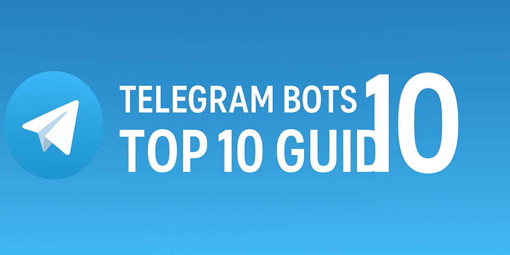

# 🚀 Awesome Telegram Bots Universe 

*"Discover the ultimate collection of Telegram bots across 10 categories, available in 10 languages - your gateway to the Telegram bot ecosystem!"*

---

## 🌟 为什么选择这个仓库？
✅ **精准分类** - 覆盖10大高频使用场景  
✅ **多语言支持** - 中/英/西/日/俄等10种语言  
✅ **持续更新** - 社区驱动 + 自动化监测  

---

## 🗂️ 分类导航
| 分类图标 | 类别名称       | 简介                  | 直达链接          |
|----------|----------------|-----------------------|-------------------|
|  | 效率工具       | PDF转换/OCR/日历管理  | [EN](#) [中文](#) |
|        | 游戏娱乐       | 多人游戏/趣味互动     | [EN](#) [中文](#) |
| ...其他8个分类...                      | ...            | ...                   | ...               |

---

## 🌍 支持语言
[English](languages/EN.md) | [中文](languages/ZH.md) | [Español](languages/ES.md) |  [Français](languages/FR.md) | [Deutsch](languages/DE.md) | [日本語](languages/JA.md) |  [Русский](languages/RU.md) | [Português](languages/PT.md) | [العربية](languages/AR.md) |  [한국어](languages/KO.md) | [हिंदी](languages/HI.md)

---

## 🤝 参与贡献
参考 [CONTRIBUTING.md](CONTRIBUTING.md) 提交新的机器人或改进翻译！

---

## 📜 许可证
[CC BY-SA 4.0](https://creativecommons.org/licenses/by-sa/4.0/)
